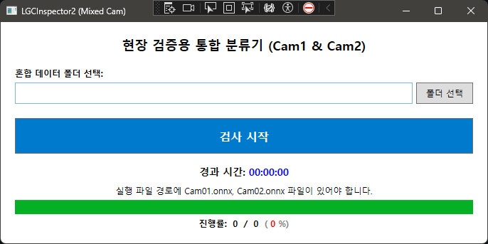

# LGCInspector2
Image Classifier Project with ResNet-18

This project was created to automate the process of sorting image data and reduce manual classification work.

### 🧩 Features
- Classification by image categories
- Runs on equipment PC without requiring internet access
- Improves workflow efficiency

### 🚀 Future Improvements
- Expand class labels
- Improve model accuracy
- Add GUI for easier usage
- 

